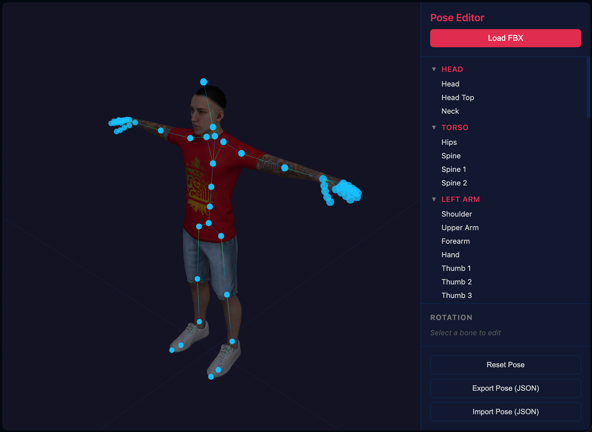

# Mixamo Pose Editor

A browser-based 3D pose editor for Mixamo characters built with Three.js. Load any Mixamo FBX model and interactively rotate bones to create custom poses.



## Features

- **Load Mixamo FBX models** via file picker or drag-and-drop
- **Interactive bone rotation** — click joint markers in the 3D viewport, then drag the rotation gizmo
- **Body-region bone tree** — bones organized into Head, Torso, Arms, and Legs groups
- **Rotation sliders** — fine-tune X/Y/Z rotation for the selected bone
- **Export/Import poses** as JSON files
- **Reset pose** back to T-pose

## Getting Started

```bash
npm install
npm run dev
```

Then open the local URL shown in the terminal.

### Loading a Character

1. Go to [mixamo.com](https://www.mixamo.com/) (free Adobe account required)
2. Pick a character and download as **FBX** with **T-Pose** (no animation)
3. In the editor, click **Load FBX** or drag-and-drop the file onto the viewport

## Controls

| Action | Input |
|--------|-------|
| Orbit camera | Left-click drag on viewport |
| Pan camera | Right-click drag |
| Zoom | Scroll wheel |
| Select bone | Click a cyan joint marker |
| Rotate bone | Drag the rotation gizmo rings |
| Deselect | Click empty space |

## Tech Stack

- [Three.js](https://threejs.org/) — 3D rendering
- [Vite](https://vitejs.dev/) — dev server and bundler
- Vanilla JS/CSS — no framework dependencies
